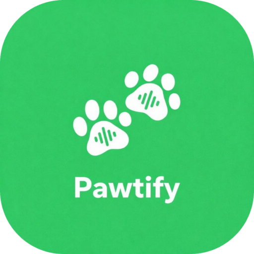

<div align="center">
  
  <h1>Pawtify</h1>
  <p><strong>A privacy-first, ad-free music streaming PWA with an AMOLED dark theme and local playlist management.</strong></p>

  [](https://opensource.org/licenses/MIT)
  [](http://makeapullrequest.com)
  [](https://developer.mozilla.org/en-US/docs/Web/Progressive_web_apps)
</div>

<hr/>

Pawtify is a beautifully designed, browser-based static music player. It leverages YouTube's vast audio library as its engine, but strips away all the ads, tracking, and heavy bloat. Built with a modular vanilla frontend and a lightweight Express API proxy, it guarantees a seamless, distraction-free audio experience on both desktop and mobile.

## ✨ Features

- 🚫 **Zero Ads & No Tracking:** Stream music without interruptions. All user data, history, and favorites are securely stored locally on your device via `localStorage`.
- 🌙 **AMOLED Dark Mode:** A stunning, battery-saving Material Design 3 UI perfectly suited for late-night listening.
- 📱 **Progressive Web App (PWA):** Install Pawtify directly to your home screen! It runs like a native app with offline caching via Service Workers.
- 🎧 **Background Playback:** Full support for the Media Session API means you can control your music from your lock screen or media keys.
- 🔍 **Powerful Discovery:** Search for songs, artists, and playlists globally, powered by the open-source `ytmusic-api`.
- 📂 **Local Playlists:** Create, edit, and curate your own custom playlists locally—no account required!

## 🚀 One-Click Deploy

You can easily host your own instance of Pawtify for free using Vercel. We've included a custom `vercel.json` optimized for Vercel's Edge CDN and Serverless Functions.

[](https://vercel.com/new/clone?repository-url=https%3A%2F%2Fgithub.com%2Fpawjects%2FPawtify)

## 💻 Local Setup & Development

**1. Clone the repository:**
```bash
git clone https://github.com/pawjects/Pawtify.git
cd Pawtify
```

**2. Install dependencies:**
```bash
npm install
```

**3. Start the application:**
```bash
npm start
```

Navigate to `http://localhost:3000` to enjoy the app!

## 🏗️ Tech Stack

- **Frontend:** Vanilla JavaScript (ES6 Modules), HTML5, CSS3 (No heavy frameworks!)
- **Backend:** Node.js, Express (API Proxy)
- **Data Persistence:** Client-side `localStorage` & Cache API
- **Integrations:** YouTube IFrame Player API, `ytmusic-api`

## 🤝 Contributing

We welcome community forks and contributions!
1. Keep frontend changes within the Vanilla ES6 module architecture.
2. Ensure API calls are proxied through the Express server to prevent CORS issues.
3. Test UI changes for mobile responsiveness and AMOLED contrast standards.

## 📄 License

This project is open-sourced software licensed under the [MIT License](LICENSE).
